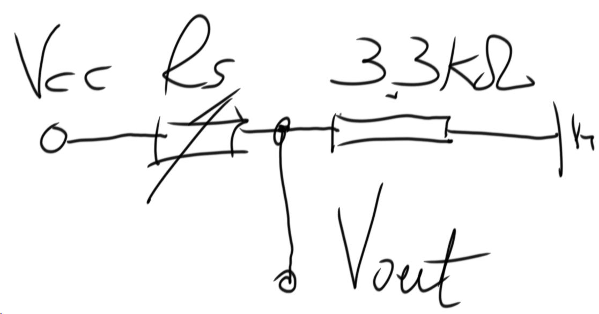

# smart lighting control

- [ ] sensor amp to high or low signal
- [ ] enable interruption to catch the sensor signal jump
  - [ ] when current state is low, when pin got a high signal. interrupt and
    transmit, vice versa.
  - [ ] when got a high signal set a 10 mins waiting.
- [ ] do a multi receivers multicast. (may be change channel is a way to do
  this.)
- [ ] try different frequency and rate, to find a appropriate combination that
  makes rssi more sensitive to transmitter distance. and do a triangle distance
  measure algorithm.
  > this is another way to do the positioning, so-called multilatering, use the
  > transsimsion, maybe more accurate but need a external time synchronize.

- [ ] Do consistence test with 3k3 ohm.
  > 

# 3-10 update
  - [ ] change the target `0x01` `pos_1` `0x2` `pos_2` `0x3`
  - [ ] test the RSSI position sensetivity.

# experiment result the `packet_avail` will return ture even if the packet's
`rx_add` wasn't the transimmiter's `my_addr`. But in the
`CC1101::rx_payload_burst` function the `rx_fifo` will overflow.  so the target
transimmter communication tx->data->rx, rx->ack->tx. will cause other
transmitter `rx_fifo` overflow at least two time.

the send_packet says the tx_fifo first three uint8 will automatically change by
burst function.

==**warning!! need to check the rssi is that was ack message storage? even it
wasn't matter though.**==

**bug** use `millis()` to count no communication interval. will 50 days
overflow.

**importtant idea**: you can actually try to use sensor_tx's rrsi or lqi to
performe the positioning algorithm and send light control signal to the taget.
to do this can reduce the signal transsformation error.
now i realise that maybe the positioning algorithm have to more computer power
that need target processor handle everything.

## prepare to the next test

need to do a g2553 float multiplication bench mark and accuary check.

## need tot write the feedforward function

